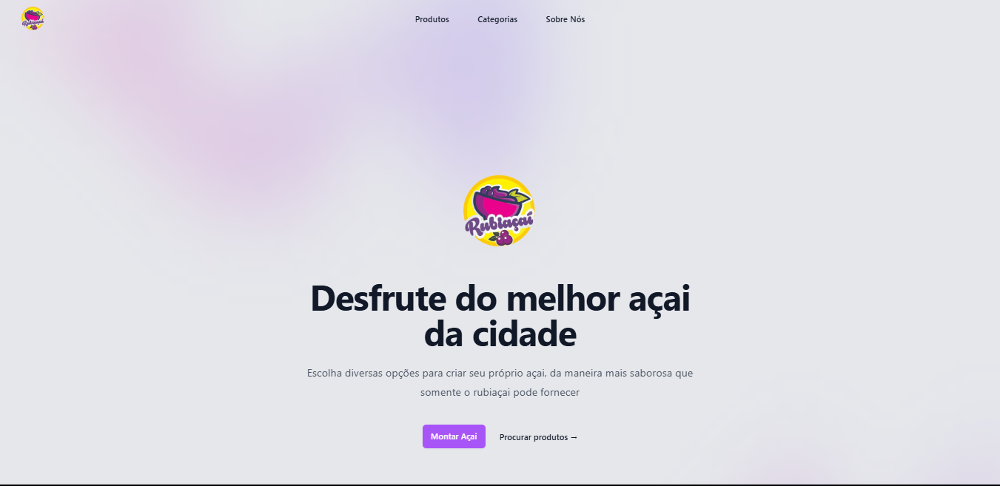
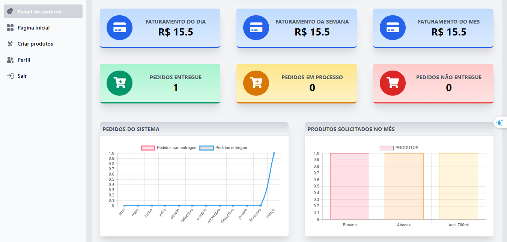
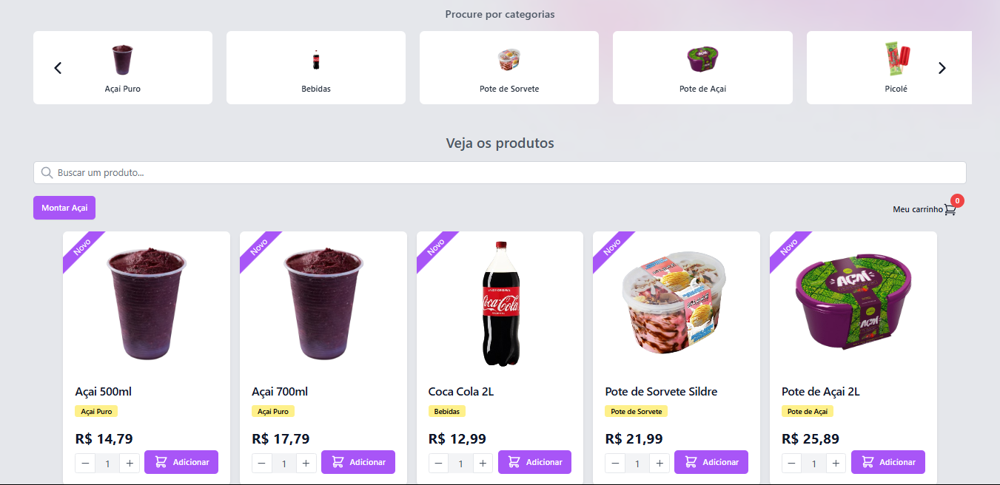

# WebApp Açaiteria  


Página Inicial do projeto 🚀


Painel do Administrador do site 🚀


Página inicial - mostrando produtos 🚀



> WepApp criado para as açaiterias que não possuem um sistema para gerenciar e fazer a venda de seus produtos, nesta aplicação, o comércio tem a opção de vender os produtos através da pagina inicial onde ele pode divulgar tudo oque comercializa, e através do painel de controle tem acesso a todos os pedidos e informações de entrega, e também gráficos para ver as vendas diárias, semanais e mensais.

### funcionalidades

O projeto conta com essas funcionalidades, e com necessidades de refatoração:

- [x] CRUD de produtos
- [x] CRUD de categorias
- [x] CRUD de acai personalizado
- [x] Middlewares de admin, e usuário
- [x] Relacionamento de tabelas
- [x] upload de imagens
- [x] Autenticação e autorização com Laravel Breeze
- [x] frontend com tailwind
- [x] paginação
- [x] busca por nome
- [x] filtro de produtos por categoria
- [x] gráfico utilizando chart.js para mostrar a escala de produtos vendidos
- [x] Ativação e desativação dos pedidos, em caso de manutenção ou folga do comércio 

## 💻 Pré-requisitos

Antes de começar, verifique se você atendeu aos seguintes requisitos:

- PHP instalando >= 8.
- Composer instalado na máquina.
- node instalado na máquina.

## 🚀 Instalando o Sistema Açaiteria  

Para instalar o Sistema Açaiteria, siga estas etapas:

clone o projeto na sua máquina
```
git clone https://github.com/bielViccari/rubiacai.git
```

vá até a pasta clonada
```
cd rubiacai
```

execute o composer install
```
composer install
```

execute o npm install para instalar as dependencias do vite
```
npm install
```

gere o arquivo .env para as variáveis do projeto
```
copy .env.example .env
```

gere a chave da sua aplicação laravel
```
php artisan key:generate
```

faça o link da storage na pasta public
```
php artisan storage:link
```

## ☕ Usando o Sistema Açaiteria 

Para usar o Sistema Açaiteria, siga estas etapas:

configure seu arquivo .env
```
DB_CONNECTION=mysql 
DB_HOST=127.0.0.1
DB_PORT=3306
DB_DATABASE=<nome-da_sua_base_de_dados>
DB_USERNAME=<username_para_acessar_sua_base>
DB_PASSWORD=<password_para_acessar_sua_base>
```
no seu banco de dados, crie uma tabela do mesmo nome do DB_DATABASE do arquivo .env

realize as migrations do projeto para o banco de dados configurado no .env
```
php artisan migrate
```

rode a aplicação com o comando
```
php artisan serve
```

rode os estilos da aplicação com 
```
npm run dev
```

## 🤝 Colaboradores

Agradecemos às seguintes pessoas que contribuíram para este projeto:

<table>
  <tr>
    <td align="center">
      <a href="#" title="defina o titulo do link">
        <br>
        <sub>
          <b>Gabriel Viccari</b>
        </sub>
      </a>
    </td>
  </tr>
</table>
